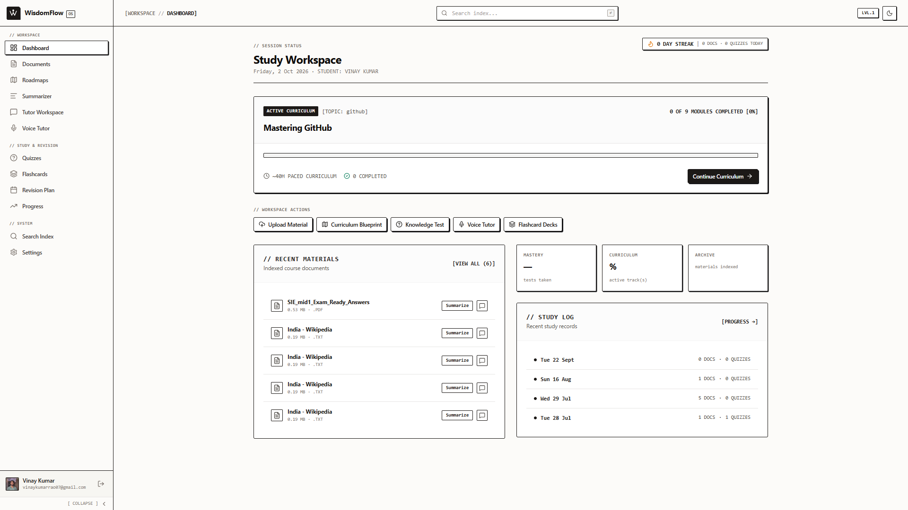
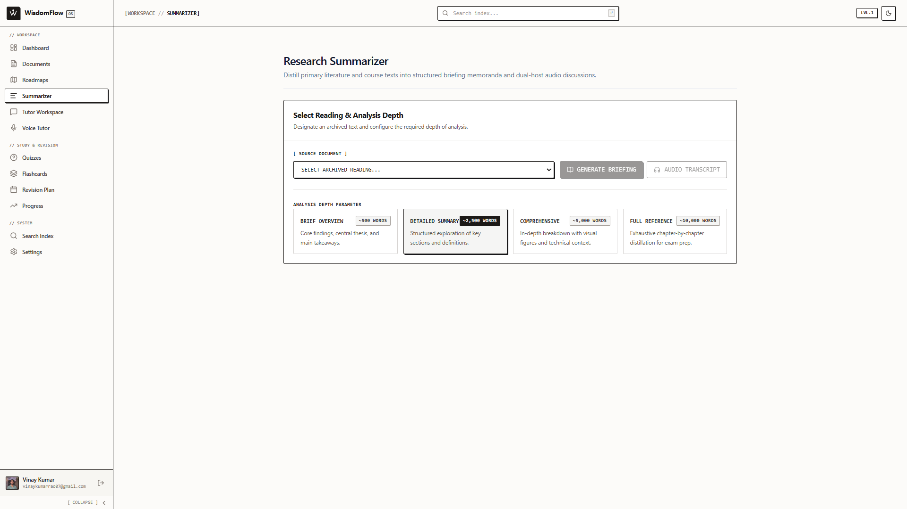
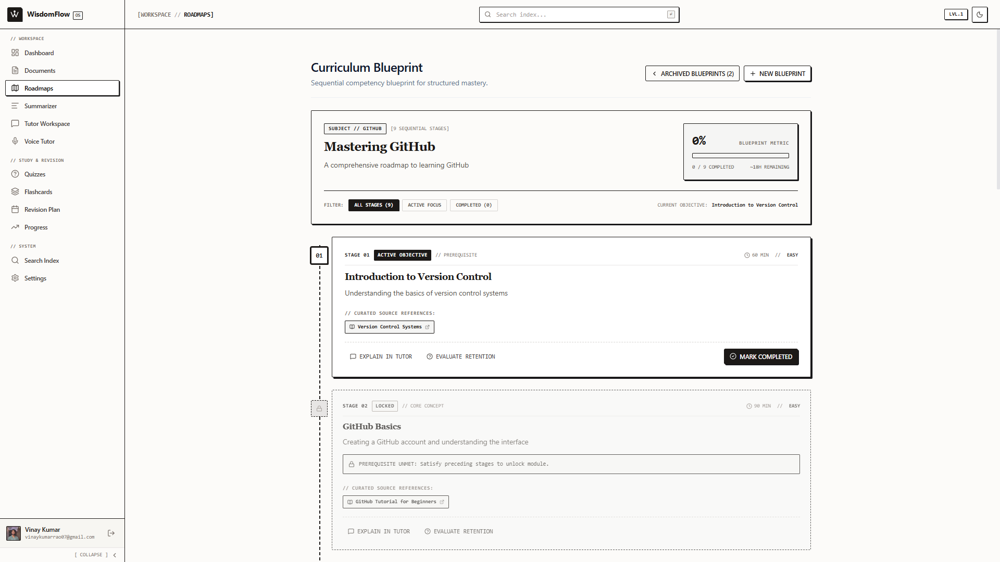
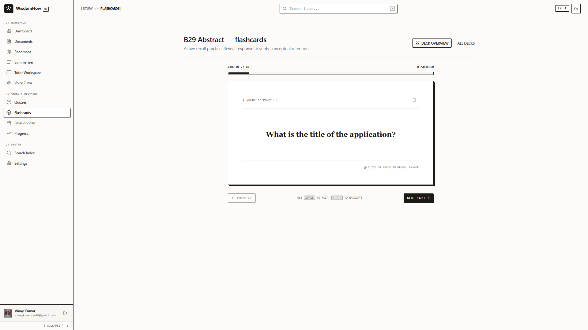

# WisdomFlow AI

[](https://react.dev/)
[](https://www.typescriptlang.org/)
[](https://vitejs.dev/)
[](https://tailwindcss.com/)
[](https://fastapi.tiangolo.com/)
[](https://www.python.org/)
[](./LICENSE)

> **Transform any document, lecture slide, or web page into an interactive, AI-powered personal learning ecosystem.** 

WisdomFlow AI combines high-accuracy multi-document RAG (Retrieval-Augmented Generation), depth-configurable summarization, real-time bi-directional voice tutoring, automated spaced-repetition quizzes & flashcards, hierarchical visual roadmaps, and automated revision scheduling.

---

## 🌐 Live Deployment & Demos

- **Frontend Application (Vercel):** [https://wisdomflow-ai.vercel.app](https://wisdomflow-ai.vercel.app)
- **Backend API (Render):** [https://wisdomflow-ai.onrender.com](https://wisdomflow-ai.onrender.com)
- **Interactive Swagger API Docs:** [https://wisdomflow-ai.onrender.com/docs](https://wisdomflow-ai.onrender.com/docs)

---

## 📸 Application Previews

### 📊 Study Workspace Dashboard
<p align="center">
  
</p>

### 🔬 Feature Showcase

<table>
  <tr>
    <td width="50%" align="center" valign="top">
      
      <br /><br />
      <b>💬 Tutor Workspace & Multi-Document RAG</b>
      <p align="left"><sub>Multi-document contextual synthesis with prompt anchors (Core Explanation, Worked Application, Retention Check, Key Axioms) and streaming SSE responses.</sub></p>
    </td>
    <td width="50%" align="center" valign="top">
      
      <br /><br />
      <b>🎙️ Acoustic Console (AI Voice Tutor)</b>
      <p align="left"><sub>Full-duplex real-time voice study session with live audio telemetry (Opus/FFT/16kHz), radial acoustic visualizer dial, and session ledger.</sub></p>
    </td>
  </tr>
  <tr>
    <td width="50%" align="center" valign="top">
      
      <br /><br />
      <b>📑 Research Summarizer</b>
      <p align="left"><sub>Configurable analysis depth: Brief Overview (~500 words), Detailed (~2,500 words), Comprehensive (~5,000 words), or Full Reference (~10,000 words) with extracted diagrams.</sub></p>
    </td>
    <td width="50%" align="center" valign="top">
      
      <br /><br />
      <b>🗺️ Curriculum Blueprint & Roadmaps</b>
      <p align="left"><sub>Structured sequential competency stages with active objectives, prerequisite locks, time estimates, curated sources, and direct tutor handoff.</sub></p>
    </td>
  </tr>
  <tr>
    <td width="50%" align="center" valign="top">
      
      <br /><br />
      <b>🧠 Active Recall Practice (Flashcards & Quizzes)</b>
      <p align="left"><sub>Interactive 3D flashcard decks with keyboard navigation (<kbd>Space</kbd> to flip, <kbd>←</kbd> / <kbd>→</kbd> to navigate), mastery tracking, and AI quizzes.</sub></p>
    </td>
    <td width="50%" align="center" valign="top">
      
      <br /><br />
      <b>📂 Course Material Index & Ingestion</b>
      <p align="left"><sub>Multi-format document repository (PDF, DOCX, PPTX, TXT) with automatic extraction, sentence chunking, and ChromaDB vector indexing.</sub></p>
    </td>
  </tr>
</table>

---

## ⚡ Key Features

### 📄 1. Multi-Format Document Ingestion & RAG
- **Broad Format Support:** Upload PDFs, DOCX, PPTX, and TXT files (up to 20MB).
- **Intelligent Processing:** Automated text extraction, diagram & image preservation (PyMuPDF), sentence-aware chunking (500-character chunks with 50-character overlaps).
- **ChromaDB Vector Store:** Auto-indexed on upload using `all-MiniLM-L6-v2` dense embeddings, with automatic startup re-indexing for stale documents.
- **Cross-Document RAG Chat:** Select one or multiple documents simultaneously with interactive selection chips. Features Server-Sent Events (SSE) streaming responses, conversational memory, and source fallbacks.

### 🎙️ 2. Real-Time AI Voice Tutor
- **Bi-Directional Audio Interaction:** Low-latency conversational learning via WebSockets.
- **Speech Stack:** Powered by **Faster-Whisper** for local/cloud Speech-to-Text (STT) and **Edge-TTS** for natural conversational Text-to-Speech (TTS).
- **Document-Grounded Conversations:** The voice tutor answers spoken queries directly from your uploaded materials with spoken-prose formatting and markdown cleaning.
- **Radial Audio Visualizer:** Dynamic canvas-rendered audio frequency visualizer reactive to voice input.

### 📑 3. Hierarchical Multi-Page Summarizer
- **Configurable Depth:** Generate 1-page executive briefs, 5-page overviews, 10-page deep-dives, or 20-page exhaustive study guides.
- **Image & Diagram Extraction:** Retains and embeds key visual figures directly into long-form summaries from PDF/PPTX sources.

### 🧠 4. Active Recall: Quizzes & Spaced-Repetition Flashcards
- **AI Quiz Generation:** Instant creation of Multiple-Choice Questions (MCQs) and True/False assessments tailored to document sections.
- **Comprehensive Explanations:** Real-time scoring with concept breakdowns for incorrect answers.
- **Interactive Flashcards:** 3D flip flashcards with bookmarking, difficulty filtering, and mastery tracking.

### 🗺️ 5. Topic Learning Roadmaps & Revision Planner
- **Prerequisite Tree Roadmaps:** Structured interactive visual trees breaking complex subjects into milestones and sub-topics.
- **Topic Mode:** Generate complete curricula directly from a prompt or concept without needing an initial document.
- **Automated Revision Schedules:** AI-generated daily and weekly spaced revision routines grounded in mastered topics.

### 🔍 6. Global Search & Analytics
- **Unified Global Search:** Fast keyword and semantic search spanning all documents, roadmap nodes, quizzes, and vector snippets.
- **Learning Streak & Analytics:** Daily study streak tracking, per-document mastery scores, and detailed progress logs.

### 🧩 7. Chrome Extension: WisdomFlow Web Clipper
- **One-Click Web Ingestion:** Manifest V3 browser extension allowing users to highlight, clip, and send web articles, research papers, or documentation straight to their personal WisdomFlow library.

---

## 🛠️ Architecture & Tech Stack

```
WisdomFlow AI
├── Frontend (Vite + React 19 + TypeScript + Tailwind CSS v4)
│   ├── State Management: Zustand
│   ├── Routing: React Router v7
│   ├── Visuals: Lucide React, Canvas Confetti, Audio Visualizers
│   └── Networking: Axios (with retry interceptors) + EventSource (SSE) + WebSocket
│
├── Backend (FastAPI + Async Python 3.11)
│   ├── ORM & Migrations: Async SQLAlchemy + Alembic
│   ├── Vector Engine: ChromaDB + Sentence Transformers (all-MiniLM-L6-v2)
│   ├── LLM Providers: Groq (Llama 3.3 70B), OpenAI, and Ollama (local fallback)
│   ├── Speech: Faster-Whisper (STT) + Edge-TTS (TTS)
│   ├── Parsers: PyMuPDF (fitz), python-docx, python-pptx, pypdf
│   └── Emails & Security: Resend API, Passlib/Bcrypt, Python-Jose (JWT)
│
└── Infrastructure & Extensions
    ├── Storage: PostgreSQL (Neon / Supabase / local) / SQLite
    ├── Hosting: Vercel (Frontend), Render (Backend)
    └── Browser: Chrome Extension (Manifest V3)
```

---

## 📂 Project Organization

```
LearnFlow AI / WisdomFlow AI
├── backend/
│   ├── app/
│   │   ├── api/v1/             # Endpoints: chat, docs, quizzes, flashcards, voice, roadmap, etc.
│   │   ├── ai/                 # Vectorstore (ChromaDB), embeddings, LLM orchestration
│   │   ├── processors/         # Document parsers, chunking, and image extractors
│   │   ├── speech/             # Faster-Whisper STT and Edge-TTS synthesis engines
│   │   ├── auth.py             # JWT authentication, login, register, token refresh
│   │   ├── config.py           # Pydantic v2 environment settings
│   │   ├── database.py         # Async engine & session management
│   │   ├── models.py           # SQLAlchemy database schemas
│   │   └── main.py             # FastAPI entrypoint, CORS, lifespan & static routes
│   ├── alembic/                # Database migrations
│   ├── requirements.txt        # Backend dependencies
│   └── .env.example            # Backend environment template
├── frontend/
│   ├── src/
│   │   ├── routes/             # App views: Dashboard, Chat, VoiceTutor, Summarizer, etc.
│   │   ├── components/         # Reusable UI widgets, audio visualizer, navbar, modals
│   │   ├── stores/             # Zustand global stores (auth, theme, documents)
│   │   ├── api/                # Axios client with interceptors
│   │   ├── App.tsx             # Root routing layout & guards
│   │   └── main.tsx            # React 19 entrypoint
│   ├── public/                 # Static branding, icons, manifest
│   ├── package.json            # Frontend dependencies
│   └── vite.config.ts          # Vite configuration with Tailwind v4
├── chrome-extension/           # WisdomFlow Web Clipper (Manifest V3)
│   ├── manifest.json
│   ├── popup.html / popup.js
│   └── background.js
├── docs/
│   └── screenshots/            # UI screenshots and visual assets
├── build.sh                    # Render backend deployment script
└── render.yaml                 # Infrastructure specification
```

---

## 🚀 Quick Start Guide

### Prerequisites
- **Node.js** 18.x or 20.x + **npm**
- **Python** 3.10+ (Python 3.11 recommended)
- **Git**
- *(Optional)* An API key for [Groq](https://console.groq.com/) (recommended for ultra-fast inference) or [OpenAI](https://platform.openai.com/), or a local [Ollama](https://ollama.ai/) instance.

---

### 1. Clone the Repository
```bash
git clone https://github.com/vinaykr-22/WisdomFlow-AI.git
cd WisdomFlow-AI
```

---

### 2. Backend Setup

```bash
cd backend

# Create and activate virtual environment
python -m venv .venv
# On Windows (PowerShell):
.venv\Scripts\Activate.ps1
# On macOS/Linux:
source .venv/bin/activate

# Install dependencies
pip install -r requirements.txt

# Configure environment variables
cp .env.example .env
# Edit .env with your configuration (see Environment Variables section below)

# Run database migrations
alembic upgrade head

# Start development server
uvicorn app.main:app --reload --host 0.0.0.0 --port 8000
```
Backend will be live at `http://localhost:8000` (API documentation at `http://localhost:8000/docs`).

---

### 3. Frontend Setup

In a new terminal window:
```bash
cd frontend

# Install dependencies
npm install

# Start Vite development server
npm run dev
```
Open `http://localhost:5173` in your browser.

---

### 4. Chrome Extension Setup (Optional)

1. Open Google Chrome and navigate to `chrome://extensions/`.
2. Enable **Developer mode** in the top-right corner.
3. Click **Load unpacked** and select the `chrome-extension/` directory from this repository.
4. The WisdomFlow Web Clipper will now appear in your browser toolbar!

---

## ⚙️ Environment Variables Reference

Create a `.env` file in the `backend/` directory based on the following:

| Variable | Description | Example / Default |
|:---|:---|:---|
| `SECRET_KEY` | Secret cryptographic key for signing JWT tokens | `generate-a-strong-random-key` |
| `DATABASE_URL` | SQLAlchemy connection string | `sqlite+aiosqlite:///./learnflow.db` *(or PostgreSQL)* |
| `LLM_API_KEY` | API key for primary LLM provider (Groq / OpenAI) | `gsk_...` or `sk-...` |
| `LLM_BASE_URL` | Base URL for LLM provider API | `https://api.groq.com/openai/v1` |
| `LLM_MODEL` | Default model identifier | `llama-3.3-70b-versatile` |
| `OLLAMA_BASE_URL` | Local fallback Ollama endpoint (optional) | `http://localhost:11434/v1` |
| `UPLOAD_DIR` | Local storage folder for uploaded documents | `uploads` |
| `STT_MODEL` | Faster-Whisper model size | `tiny`, `base`, or `small` |
| `TTS_VOICE` | Microsoft Edge TTS voice model | `en-US-AvaNeural` |
| `RESEND_API_KEY` | Resend API key for password reset emails | `re_...` *(optional)* |
| `FRONTEND_URL` | URL of frontend for email reset links | `http://localhost:5173` |
| `ALLOWED_ORIGINS` | Comma-separated list of allowed CORS origins | `http://localhost:5173,http://localhost:8000` |

---

## 🔌 API Overview

WisdomFlow AI provides comprehensive REST and real-time streaming endpoints:

| Module | Method & Path | Description |
|:---|:---|:---|
| **Auth** | `POST /api/v1/auth/register` | Register a new user account |
| **Auth** | `POST /api/v1/auth/login` | Authenticate and obtain JWT access token |
| **Auth** | `POST /api/v1/auth/forgot-password` | Request password reset token via email |
| **Documents** | `POST /api/v1/documents/upload` | Upload & auto-index PDF/DOCX/PPTX/TXT document |
| **Documents** | `GET /api/v1/documents` | List uploaded user documents and processing status |
| **RAG Chat** | `POST /api/v1/chat` | Multi-document SSE streaming context-aware chat |
| **Summarizer** | `POST /api/v1/summarize` | Multi-page depth summaries (1, 5, 10, 20 pages) |
| **Voice Tutor** | `WS /api/v1/voice/ws` | Bi-directional WebSocket speech & conversational tutor |
| **Quizzes** | `POST /api/v1/quizzes/generate` | Generate MCQ / True-False assessment |
| **Flashcards** | `POST /api/v1/flashcards/generate` | Generate spaced-repetition card sets |
| **Roadmap** | `POST /api/v1/roadmap/generate` | Generate interactive prerequisite study graph |
| **Revision** | `GET /api/v1/revision/today` | Fetch automated daily revision recommendations |
| **Search** | `GET /api/v1/search?q={query}` | Global keyword and semantic cross-resource search |
| **Progress** | `GET /api/v1/progress/dashboard` | Retrieve study streak, stats, and document mastery |

---

## 🤝 Contributing

Contributions, feedback, and feature suggestions are warmly welcomed!
1. Fork the Project.
2. Create your Feature Branch (`git checkout -b feature/AmazingFeature`).
3. Commit your Changes (`git commit -m 'Add some AmazingFeature'`).
4. Push to the Branch (`git push origin feature/AmazingFeature`).
5. Open a Pull Request.

Please refer to [`CONTRIBUTING.md`](./CONTRIBUTING.md) for more details.

---

## 📜 License

Distributed under the MIT License. See [`LICENSE`](./LICENSE) for more information.

---

## 👨‍💻 Maintainer & Contact

- **Author:** Vinay Kumar ([@vinaykr-22](https://github.com/vinaykr-22))
- **Email:** vinaykumarrao07@gmail.com
- **Project Repository:** [https://github.com/vinaykr-22/WisdomFlow-AI](https://github.com/vinaykr-22/WisdomFlow-AI)
